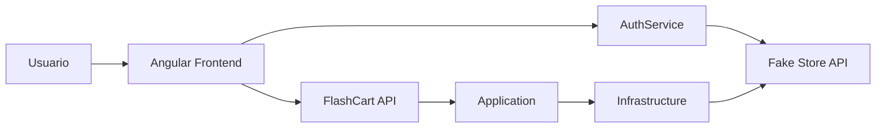
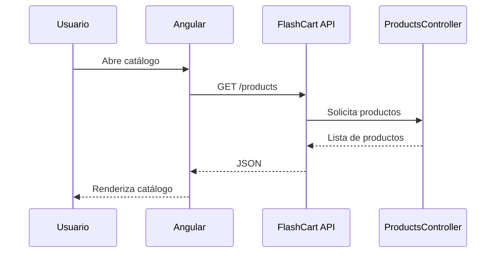
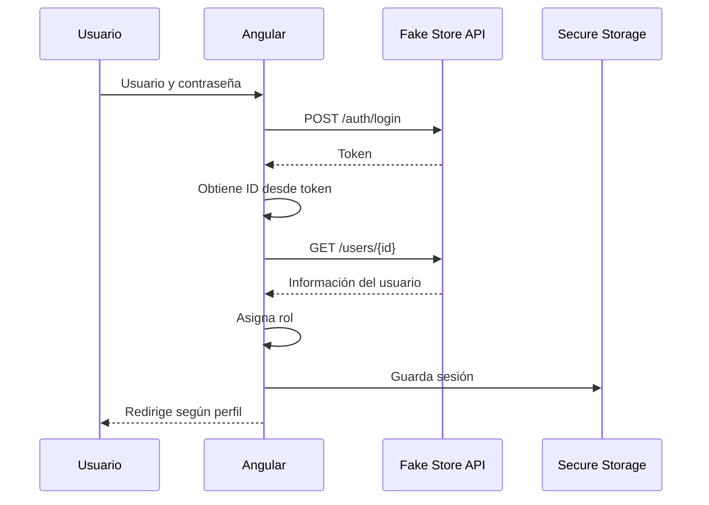

# ⚡ FlashCart

Aplicación de comercio electrónico desarrollada como proyecto académico, compuesta por un **frontend en Angular** y una **API REST en ASP.NET Core**.

FlashCart implementa autenticación, administración de sesión, control de acceso mediante roles, catálogo de productos y filtrado, manteniendo una separación clara de responsabilidades entre frontend, lógica de aplicación, dominio e infraestructura.

---

## 🛒 Descripción

El objetivo de FlashCart es simular el funcionamiento de una plataforma de comercio electrónico moderna mediante una arquitectura modular.

El proyecto integra:

- Inicio de sesión mediante **Fake Store API**.
- Asignación local de perfiles de usuario.
- Persistencia segura de sesión.
- Protección de rutas.
- Control de acceso basado en roles.
- Catálogo de productos.
- Filtrado de productos por categoría.
- Manejo de errores de conexión.
- Estado reactivo mediante Angular Signals.
- Backend propio desarrollado con ASP.NET Core.
- Separación del backend en capas.
- Integración preparada con Fake Store API mediante `HttpClient`.
- Soporte para funcionalidades móviles mediante Capacitor.

---

## 🧰 Tecnologías

### Frontend

- Angular 22
- TypeScript 6
- SCSS
- RxJS
- Angular Signals
- Angular Router
- Angular HttpClient
- Capacitor
- Capacitor Network
- Capacitor Secure Storage
- Vitest
- npm

### Backend

- .NET 10
- ASP.NET Core Web API
- C#
- Dependency Injection
- HttpClient
- OpenAPI
- Entity Framework Core Design
- Clean Architecture

### Servicios externos

- Fake Store API

---

## 🏗️ Arquitectura

El repositorio está dividido en dos aplicaciones principales:

```text
FlashCart/
│
├── backend/
│   ├── FlashCart.slnx
│   │
│   └── src/
│       ├── FlashCart.API/
│       ├── FlashCart.Application/
│       ├── FlashCart.Domain/
│       └── FlashCart.Infrastructure/
│
├── frontend/
│   ├── src/
│   │   └── app/
│   │       ├── components/
│   │       ├── core/
│   │       ├── features/
│   │       ├── models/
│   │       └── services/
│   │
│   ├── angular.json
│   ├── package.json
│   └── tsconfig.json
│
└── README.md
```

### Backend

El backend sigue una separación inspirada en **Clean Architecture**.

```text
┌─────────────────────────┐
│     FlashCart.API       │
│ Controllers / Endpoints │
└────────────┬────────────┘
             │
             ▼
┌─────────────────────────┐
│ FlashCart.Application   │
│ Services / Interfaces   │
└────────────┬────────────┘
             │
             ▼
┌─────────────────────────┐
│    FlashCart.Domain     │
│       Entities          │
└─────────────────────────┘
             ▲
             │
┌────────────┴────────────┐
│ FlashCart.Infrastructure│
│ Repositories / External │
└─────────────────────────┘
```

### `FlashCart.Domain`

Contiene las entidades centrales del sistema y no depende de las capas externas.

Actualmente incluye el modelo de producto y su información de valoración.

### `FlashCart.Application`

Contiene los contratos y servicios de aplicación.

Entre ellos:

```text
IProductRepository
IProductService
ProductService
```

Esta capa permite desacoplar la lógica del negocio de la fuente real de datos.

### `FlashCart.Infrastructure`

Implementa los servicios definidos por la capa Application.

Incluye:

```text
FakeStoreProductRepository
FakeStoreApiOptions
DependencyInjection
```

El repositorio utiliza `HttpClient` para comunicarse con Fake Store API.

### `FlashCart.API`

Expone los recursos del sistema mediante HTTP.

El frontend consume actualmente:

```http
GET /products
```

La aplicación también contempla endpoints para obtener categorías y productos filtrados.

---

## 🔄 Flujo general



Actualmente la autenticación se realiza directamente contra **Fake Store API**, mientras que el catálogo principal puede consumirse desde la API propia de FlashCart.

---

## 🔐 Autenticación

El inicio de sesión utiliza:

```text
POST https://fakestoreapi.com/auth/login
```

Después de recibir el token:

1. Se valida que la API haya devuelto un token.
2. Se obtiene el identificador del usuario desde el payload.
3. Se consulta la información del usuario.
4. Se asigna un rol local.
5. Se crea la sesión.
6. La sesión se almacena de forma segura.
7. El usuario es redirigido según su perfil.

---

## 👥 Roles

FlashCart maneja tres perfiles:

| Rol | Acceso |
|---|---|
| Administrador | Panel administrativo |
| Auditor | Panel de auditoría |
| Cliente | Catálogo de productos |

Para fines de simulación, la asignación de roles se realiza localmente utilizando el ID recibido desde Fake Store API:

```text
ID 1 - 2  → Administrador
ID 3      → Auditor
Otros     → Cliente
```

Esto permite probar diferentes perfiles sin depender de un sistema externo de autorización.

---

## 🛡️ Protección de rutas

Angular utiliza guards para evitar acceso no autorizado.

### `authGuard`

Verifica que exista una sesión válida antes de permitir acceso a rutas protegidas.

### `roleGuard`

Comprueba que el usuario tenga alguno de los roles permitidos para la ruta solicitada.

Ejemplo:

```text
/admin
   ↓
authGuard
   ↓
roleGuard
   ↓
Administrador
```

Las rutas principales son:

```text
/login
/catalogo
/admin
/auditor
```

---

## 💾 Sesión segura

La información de sesión se maneja mediante:

```text
@aparajita/capacitor-secure-storage
```

La sesión se almacena bajo la clave:

```text
flashcart_session
```

Esto permite recuperar el estado del usuario cuando la aplicación se vuelve a abrir.

---

## 🚪 Cierre de sesión

El flujo de logout realiza una limpieza completa del estado relacionado con el usuario.

Al cerrar sesión:

```text
Sesión segura
      ↓
   eliminada

Estado de autenticación
      ↓
   reiniciado

Carrito en memoria
      ↓
     vacío

Usuario
      ↓
   /login
```

De esta manera se evita conservar información de una sesión anterior.

---

## 🌐 Control de conectividad

FlashCart utiliza:

```text
@capacitor/network
```

Antes del inicio de sesión se comprueba que exista conexión a internet.

En navegador se utiliza como respaldo:

```javascript
navigator.onLine
```

Esto permite diferenciar errores de credenciales de problemas reales de conectividad.

---

## 🛍️ Catálogo

El catálogo obtiene los productos mediante el servicio:

```text
ProductService
```

que consulta:

```http
GET http://localhost:5178/products
```

El componente maneja estados independientes para:

```text
loading
products
error
```

También dispone de una imagen alternativa cuando la imagen original del producto no puede cargarse.

---

## 🔎 Filtrado por categoría

El proyecto contiene funcionalidad para filtrar los productos por categoría.

Actualmente se contemplan categorías de ejemplo como:

```text
Electronics
Clothing
```

El filtrado permite:

- Mostrar todos los productos.
- Seleccionar una categoría.
- Mostrar únicamente productos pertenecientes a esa categoría.
- Cambiar de filtro sin volver a cargar la aplicación.

---

## 🧪 Datos simulados

En el estado actual del Sprint, `ProductsController` utiliza productos locales para simular la respuesta de un backend propio.

Ejemplos incluidos:

```text
Laptop Gamer
Camiseta Deportiva
Audífonos Bluetooth
Pantalón Jean
```

Esto permite desarrollar y probar las historias relacionadas con el catálogo sin depender completamente de un servicio externo.

Al mismo tiempo, la capa `Infrastructure` ya contiene:

```text
FakeStoreProductRepository
```

para permitir la integración con Fake Store API mediante la arquitectura definida.

---

## ⚙️ Configuración del backend

La API está configurada para ejecutarse localmente en:

```text
HTTP:
http://localhost:5178

HTTPS:
https://localhost:7205
```

El frontend utiliza actualmente:

```text
http://localhost:5178
```

como dirección base.

CORS permite peticiones desde:

```text
http://localhost:4200
```

---

## 🚀 Ejecución del proyecto

### 1. Clonar el repositorio

```bash
git clone https://github.com/PHW140506/FlashCart.git
cd FlashCart
```

La rama principal utilizada actualmente por el proyecto es:

```bash
git switch sp1
```

---

## ⚙️ Ejecutar Backend

Se requiere tener instalado el **.NET 10 SDK**.

Desde la raíz del repositorio:

```bash
dotnet restore backend/FlashCart.slnx
```

Después:

```bash
dotnet run --project backend/src/FlashCart.API/FlashCart.API.csproj
```

La API estará disponible en:

```text
http://localhost:5178
```

---

## 🌐 Ejecutar Frontend

Abrir otra terminal:

```bash
cd frontend
```

Instalar dependencias:

```bash
npm install
```

Ejecutar Angular:

```bash
npm start
```

También puede utilizarse:

```bash
npx ng serve
```

La aplicación estará disponible en:

```text
http://localhost:4200
```

---

## 🏗️ Compilar el proyecto

### Backend

```bash
dotnet build backend/FlashCart.slnx
```

### Frontend

```bash
cd frontend
npm run build
```

Los archivos compilados del frontend se almacenan en:

```text
frontend/dist/
```

---

## 🧪 Pruebas

Para ejecutar las pruebas del frontend:

```bash
cd frontend
npm test
```

El proyecto utiliza **Vitest** como runner de pruebas.

---

## 📡 Endpoints

### Obtener productos

```http
GET /products
```

Ejemplo:

```text
http://localhost:5178/products
```

### Obtener categorías

```http
GET /products/categories
```

### Filtrar por categoría

```http
GET /products/category/{category}
```

Ejemplo:

```text
GET /products/category/Electronics
```

---

## 📱 Capacitor

Aunque el frontend puede ejecutarse como una aplicación web Angular convencional, el proyecto incluye dependencias de Capacitor para permitir características específicas de dispositivos.

Actualmente se utilizan principalmente para:

```text
Network
Secure Storage
```

Esto permite que la misma base del frontend pueda evolucionar posteriormente hacia una aplicación móvil.

---

## 🧠 Principios aplicados

El proyecto busca mantener una estructura modular utilizando principios como:

- Separación de responsabilidades.
- Inyección de dependencias.
- Programación contra interfaces.
- Bajo acoplamiento.
- Encapsulamiento.
- Servicios especializados.
- Componentes reutilizables.
- Estado reactivo.
- Protección de rutas.
- Manejo centralizado de sesión.
- Separación entre dominio e infraestructura.

La división:

```text
API
Application
Domain
Infrastructure
```

evita que las reglas centrales de la aplicación dependan directamente de detalles externos como HTTP o Fake Store API.

---

## 🔄 Flujo de productos



---

## 🔐 Flujo de autenticación



---

## ✅ Funcionalidades implementadas

Entre las funcionalidades presentes actualmente se encuentran:

- Inicio de sesión.
- Obtención y validación de token.
- Descarga de información del usuario.
- Asignación local de perfiles.
- Sesiones persistentes.
- Almacenamiento seguro.
- Control de conectividad.
- Guards de autenticación.
- Guards basados en roles.
- Cierre de sesión.
- Limpieza del carrito al cerrar sesión.
- Catálogo general de productos.
- Manejo de carga y errores.
- Fallback de imágenes.
- Filtrado por categorías.
- API propia de productos.
- CORS para comunicación Angular/API.
- Arquitectura por capas en backend.
- Repositorio externo para Fake Store API.

---

## 🌱 Estado del proyecto

FlashCart se encuentra actualmente en desarrollo.

La rama utilizada como base de integración es:

```text
sp1
```

El proyecto continúa evolucionando mediante historias de usuario implementadas en ramas independientes y posteriormente integradas mediante Pull Requests.

---

## 📚 Proyecto académico

Este repositorio fue desarrollado con fines educativos para practicar el desarrollo de una aplicación Full Stack aplicando:

```text
Angular
TypeScript
ASP.NET Core
C#
REST APIs
POO
Dependency Injection
Arquitectura por capas
Control de versiones con Git
GitHub Flow
```

---

<p align="center">
  <strong>⚡ FlashCart</strong><br>
  Angular + ASP.NET Core
</p>
